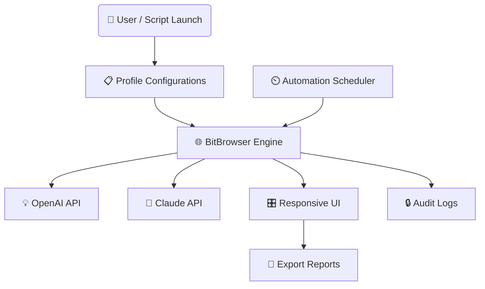

# 🕹️ AutoCortex - The Next-Gen Browser Task Commander

Manage, automate, and supercharge bulk web-based processes (like student discount verifications, automated form filling, browser identity management, and secure session cycling) on an epic scale via a seamless dashboard powered by OpenAI and Claude APIs.

  
---

**AutoCortex** is an orchestration platform combining browser profile automation, AI-driven decision making, and a multilingual, responsive UI. Designed for power users, organizations, and digital efficiency architects who want to move beyond manual browser labor towards a lunar leap in workflow automation. 🌔

> 🌱 **Why settle for repetitive, isolated browser tasks when you can nurture an entire forest of automated operations in harmony?** With AutoCortex, spin up, monitor, and manage browser instances across any OS, infused with the intelligence of OpenAI and Claude’s wisdom.

---

## ☄️ Table of Contents

- [Vision](#vision)
- [Features 🚀](#features-🚀)
- [OS Compatibility 🌈](#os-compatibility-🌈)
- [Profile Configuration Example 📋](#profile-configuration-example-📋)
- [Sample Console Command ⚡](#sample-console-command-⚡)
- [Key Integrations 🔗](#key-integrations-🔗)
- [Mermaid Diagram 🖊️](#mermaid-diagram-🖊️)
- [How To Get Started 🏁](#how-to-get-started-🏁)
- [SEO-Driven Use Cases & Benefits 💡](#seo-driven-use-cases--benefits-💡)
- [FAQ ❓](#faq-❓)
- [Disclaimer 🍃](#disclaimer-🍃)
- [License 📜](#license-📜)

---

## Vision

**AutoCortex** aspires to be the “central nervous system” for all browser-based automations. Imagine routing hundreds of browser identities, filling forms for student benefits, and conducting data validation at AI speeds—while you sip your tea.
  
---

## Features 🚀

- **Browser Profile Automation Engine:** Orchestrate diverse browser identities securely (ideal for multi-account workflows).
- **Form Completion Syndicate:** Automate repetitive verification, signup, and application forms—en-masse.
- **OpenAI & Claude AI Brains:** Infuse workflow nodes with GPT & Claude-powered interpretation for smarter bottleneck resolution.
- **Responsive Dashboard:** Modern, adaptable UI for desktop, tablet, or mobile.
- **Multilingual Support:** Out-of-the-box translation support (English, Español, Français, 中文, and more).
- **Workflow Templates Library:** Share, import, and export automation templates with configuration wizards.
- **Session Monitoring:** Live stream all browser actions for compliance and error detection.
- **24/7 Customer Support:** Our agents (and AI assistants) provide round-the-clock help and guidance.
- **Role-Based Access:** Customize permission levels for teams, clients, or project cohorts.
- **Exportable Logs & Reports:** Download activity snapshots for audits or reviews.
- **Integrated Scheduler:** Run tasks at custom intervals or specific event triggers.

---

## OS Compatibility 🌈

|  OS               | Supported | Notes           |
|------------------ |-----------|-----------------|
| 🖥️ Windows 10/11  |    ✅     | Full Feature    |
| 🐧 Ubuntu 20.04+  |    ✅     | CLI & GUI       |
| 🍏 macOS 12+      |    ✅     | Native support  |
| 📱 Android        |    ⚡     | Experimental    |
| 📱 iOS            |    ⚡     | Roadmap Q2 2026 |

---

## Profile Configuration Example 📋

Here’s a taste of how you might configure a robust browser profile group for multi-instance automation:

    profiles:
      - name: “UniDiscount_1”
        device_type: “desktop”
        vpn: “us-east”
        cookies_path: “./cookies/ud1.json”
        agent: “Mozilla/5.0 AutoCortex”
        language: “en_US”
        custom_ai_parameters:
          ai_service: “OpenAI”
          reasoning_level: “autonomous”
      - name: “UniDiscount_2”
        device_type: “laptop”
        vpn: “uk-london”
        cookies_path: “./cookies/ud2.json”
        agent: “Mozilla/5.0 AutoCortex”
        language: “fr_FR”
        custom_ai_parameters:
          ai_service: “Claude”
          reasoning_level: “assistive”

---

## Sample Console Command ⚡

This is how you might bootstrap a full-blown mass verification session across 4 universities and 100 users:

    autocortex run --config uni-bulk.yaml --template student_discount --report report_final.csv --language zh_CN --ai gpt4 --schedule "2026-09-01T00:00:00"

---

## Key Integrations 🔗

- **OpenAI API (GPT-3, GPT-4, etc.):** Natural language parsing of web page content, error resilience, and decision making.
- **Claude API:** Proactive suggestions, fallback resolution, and compliance documentation.
- **Secure BitBrowser Engine:** Sandboxed identity and session management.
- **Core Scheduling API:** Advanced ETL-ready automation pipelines.

Integrations are modular—plug, play, and connect future tools with ease!

---

## Mermaid Diagram 🖊️

---

## How To Get Started 🏁

### 1. Download the release

### 2. Install dependencies

- Requires: Python 3.10+, Node.js 18+, Docker (optional for service containers)
- See `INSTALL.md` for detailed steps.

### 3. Configure your profiles

- Edit `profiles.yaml` with your workflow settings and AI choices.

### 4. Run your first orchestrated browser session

    autocortex run --config=myprofiles.yaml --template=mytemplate.json

### 5. Visit your dashboard!

- Real-time view and controls at `http://localhost:6500`.

---

## SEO-Driven Use Cases & Benefits 💡

- **Bulk Student Discount Management:** Expedite campus or corporate benefit verifications at scale.
- **Digital Marketing Automation:** Simulate traffic, test sign-ups, and manage multi-platform personas.
- **Fraud Analysis & Testing:** Cycle IDs, validate security, and conduct penetration automation.
- **Form Workflow Streamlining:** Automate any repeated browser-based application or onboarding pipeline.
- **Modern Team Automation:** Delegate browser tasks to AI agents, freeing up human minds for innovation.
- **Comprehensive Compliance Reporting:** Create auditable trails for any regulatory or business requirement.
- **Global Accessibility:** Multilingual and mobile-responsive features reach staff and clients worldwide.

---

## FAQ ❓

**Q: Can I add my own AI integration?**  
A: Absolutely—AutoCortex is designed around pluggable APIs. Drop-in any third-party LLM or data source.

**Q: Is this safe for sensitive operations?**  
A: All processes use isolated sessions. Sensitive data is never logged unless explicitly configured.

**Q: What’s unique about AutoCortex compared to browser automation libraries?**  
A: It merges best-in-breed browser automation with AI-powered orchestration, enriched reporting, and human-centric UI.

**Q: Can I run this 24/7?**  
A: Yes, designed for production reliability, with auto-recovery and 24/7 support channels.

**Q: How do I request a new feature?**  
A: Submit via the dashboard or open a ticket—our roadmap is community-driven.

---

## Disclaimer 🍃

AutoCortex is an automation toolkit intended solely for ethical, legal, and authorized uses. Users must comply with all applicable terms, policies, and regulations when automating web operations. The authors disclaim any responsibility for misuse, non-compliance, or prohibited automation. You are solely responsible for ensuring your actions conform to all relevant guidelines.

---

## License 📜

AutoCortex is licensed under the MIT License 2026. For details, see the [LICENSE](./LICENSE) file.

---

  

---

*Move beyond the browser and let AutoCortex be your digital symphony conductor in 2026 and beyond!* 🚀